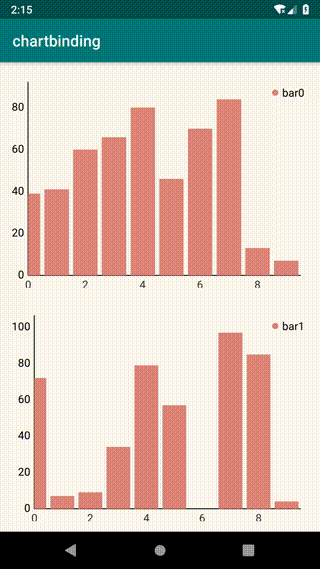

[](https://github.com/hotstu)
[ ](https://bintray.com/hglf/maven/chartbinding/_latestVersion)
[](https://opensource.org/licenses/Apache-2.0)
[](https://jitpack.io/#hotstu/chartbinding)

chartbinding
=============
使用DataBing对MPAndroidChart进行封装， 使用MVVM方式开发图表(饼状图、折线图、饼状图)
MPAndroidChart默认的样式太难看，设置起来也太复杂，这里提供了一套默认的样式（配色来自Echart）,并且可以通过style指定配色方案，
使用的时候只用关注数据、绑定数据大大提升了开发体验

Android DataBinding wrapper for MPAndroidChart, using chart in a MVVM way!
the goal of this lib is to making a more simple way to make chart for light charting usage,
avoiding the complex property settings.



## How to use

just Add the dependency
```
	dependencies {
	        implementation 'com.github.hotstu:chartbinding:1.0.0'
	}

```
then checkout the demo project for more

<br/>

## limits

only limited type of charts are supported(bar/line/pie)

### more

|Github|简书| 掘金|JCenter | dockerHub|
| -------------| ------------- |------------- |------------- |------------- |
| [Github](https://github.com/hotstu)| [简书](https://www.jianshu.com/u/ca2207af2001) | [掘金](https://juejin.im/user/5bee320651882516be2ebbfe) |[JCenter ](https://bintray.com/hglf/maven)      | [dockerHub](https://hub.docker.com/u/hglf)|
# License

Copyright 2018 hglf

Licensed under the Apache License, Version 2.0 (the "License");
you may not use this file except in compliance with the License.
You may obtain a copy of the License at

    http://www.apache.org/licenses/LICENSE-2.0

Unless required by applicable law or agreed to in writing, software
distributed under the License is distributed on an "AS IS" BASIS,
WITHOUT WARRANTIES OR CONDITIONS OF ANY KIND, either express or implied.
See the License for the specific language governing permissions and
limitations under the License.

<br/>
